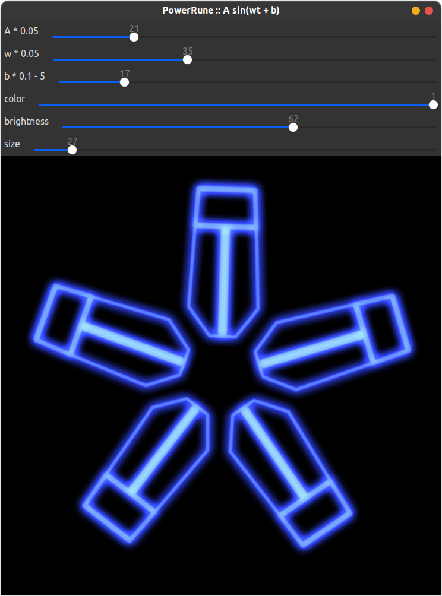

# Power Rune Simulator




## Dependencies

```shell
$ sudo apt install opencv-data libopencv-dev libeigen3-dev
```

## Build & Run

```shell
$ git clone https://github.com/UoN-Lancet/PowerRuneSimulator.git
$ cd PowerRuneSimulator
$ mkdir -p build && cd build
$ cmake ..
$ make
$ ./power_rune
```
